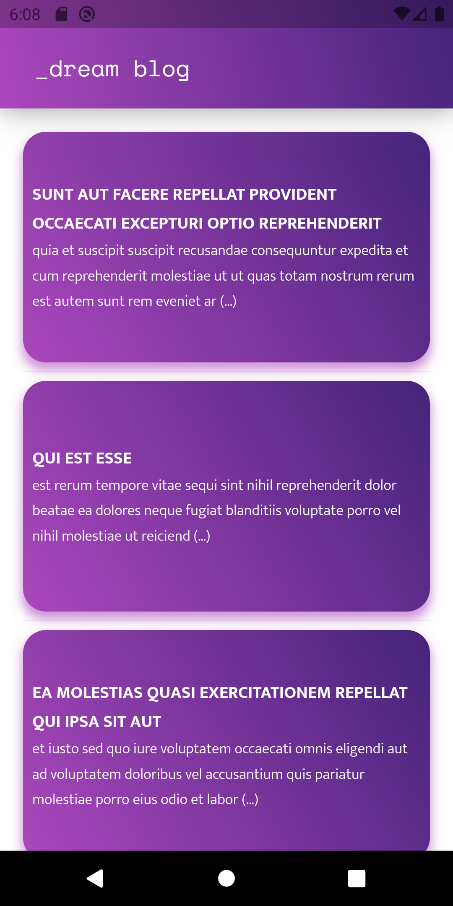
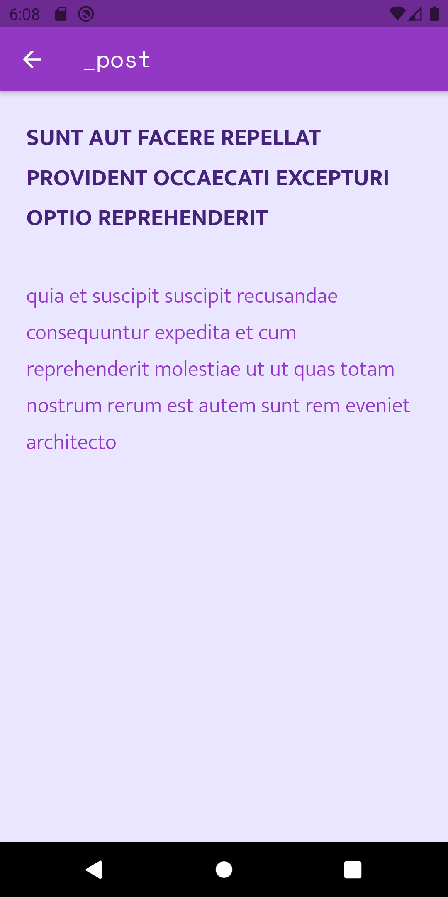
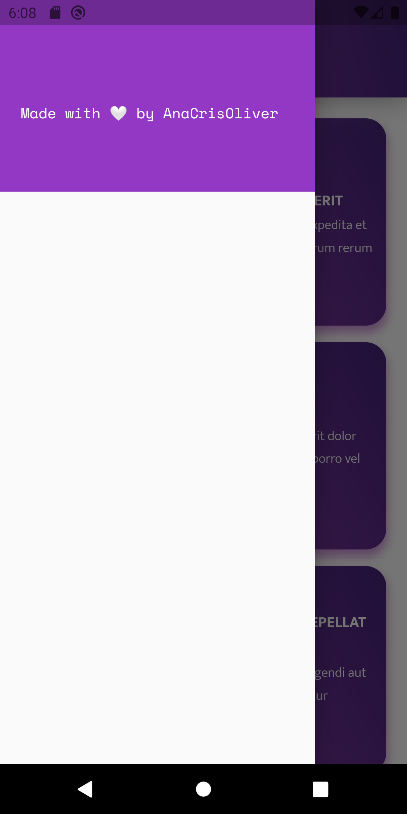

# _dream blog project 👩‍💻

This is my first Flutter project, a simple mobile app inspired by [Dreamlabs blog](https://dreamlabs.com.br/blog/). It was an interesting project to make because it allowed me to learn the basics of Dart programming language and its sintax.

## So, how it works? ⚙️
The app starts with a homepage containing [100 posts](https://jsonplaceholder.typicode.com/posts).To fill the posts with content I used [this JSON API](https://jsonplaceholder.typicode.com/guide/), getting and placing the info in the homepage. The original post is composed by a title and a body, wich I decided to limit to 150 characters, so the homepage doesn't look polluted, but instead, easy and quickly to read. When you perform an action like taping one post it opens a new page with the full content. Yet, if you swipe to the right, you're going to see more info about the app.

## How it looks like? 🤳

### The homepage 🏠

### The post itself 📜

### The sidebar ℹ️

## Running this app 🏃‍♀️
If you don't know how to run a Flutter project, follow this steps:  

 - Make shure you have [Flutter](https://flutter.dev/docs/get-started/install) installed on your computer, and if you don't, there are many YouTube tutorials out there, as [this one for Windows](https://www.youtube.com/watch?v=T9LdScRVhv8) or [this one for Ubuntu](https://www.youtube.com/watch?v=cYB_I6pPHiQ). 

 - Clone this repository:  
**$ git clone https://github.com/AnaCrisOliver/learning-flutter.git**

 - Follow [this](https://flutter.dev/docs/get-started/test-drive?tab=androidstudio) Flutter tutorial  

## Want to learn more about Flutter? 📚
Here are few resources to get you started on Flutter:

- [Lab: Write your first Flutter app](https://flutter.dev/docs/get-started/codelab)
- [Cookbook: Useful Flutter samples](https://flutter.dev/docs/cookbook)

For help getting started with Flutter, view our
[online documentation](https://flutter.dev/docs), which offers tutorials,
samples, guidance on mobile development, and a full API reference.
