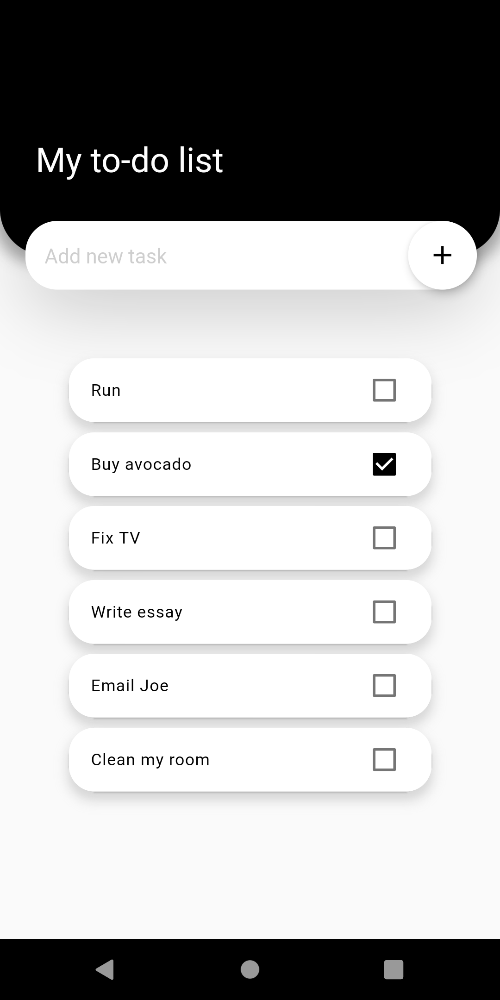
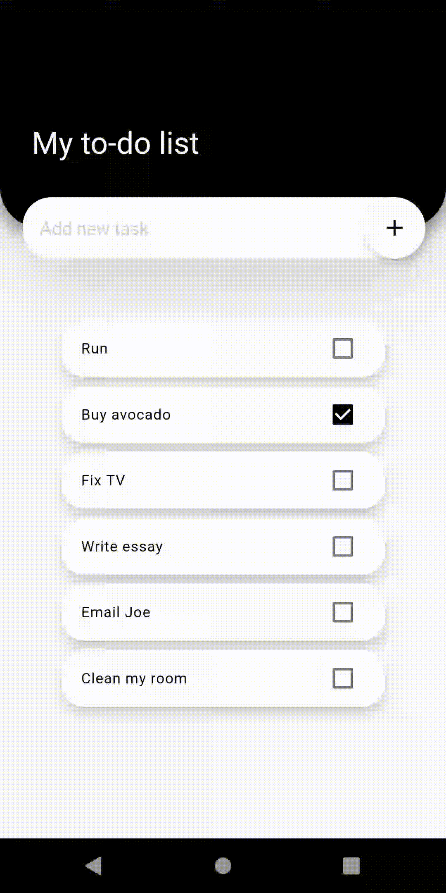
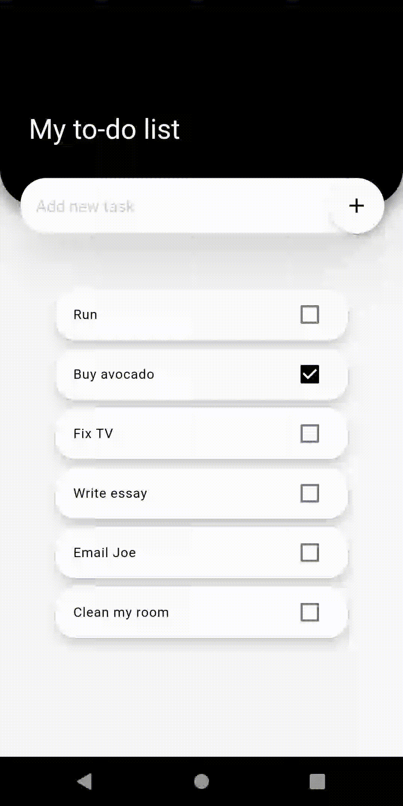
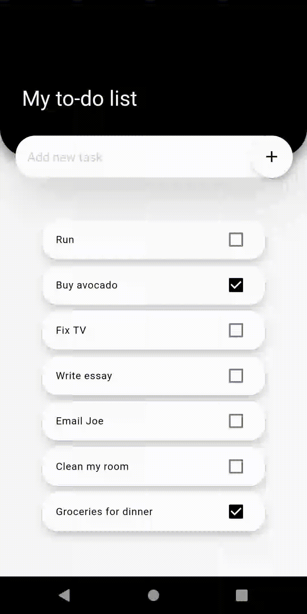

# To-do List Project ✔️

This is my second Flutter project, a simple to-do list app inspired by [Andre Baltieri](https://www.youtube.com/watch?v=0OnQrqs17wI). It was an interesting project to make because it allowed me to practice my frontend skills.

## So, how it works? ⚙️
The app starts with a homepage containing a list of tasks. From there, you can mark a task as done or delete it by swapping the task box to the right or left. If you wanna add a new task than you can simply type the text you want on the "add new text" box and click the (+) button.

## How it looks like? 🤳

### The homepage 🏠

### Marking a task as done ✔️

### Adding a new task ➕

### Deleting a task 🔴

## Running this app 🏃‍♀️
If you don't know how to run a Flutter project, follow this steps:  

 - Make shure you have [Flutter](https://flutter.dev/docs/get-started/install) installed on your computer, and if you don't, there are many YouTube tutorials out there, as [this one for Windows](https://www.youtube.com/watch?v=T9LdScRVhv8) or [this one for Ubuntu](https://www.youtube.com/watch?v=cYB_I6pPHiQ). 

 - Clone this repository:  
**$ git clone https://github.com/AnaCrisOliver/learning-flutter.git**

 - Follow [this](https://flutter.dev/docs/get-started/test-drive?tab=androidstudio) Flutter tutorial  

## Want to learn more about Flutter? 📚
Here are few resources to get you started on Flutter:

- [Lab: Write your first Flutter app](https://flutter.dev/docs/get-started/codelab)
- [Cookbook: Useful Flutter samples](https://flutter.dev/docs/cookbook)

For help getting started with Flutter, view our
[online documentation](https://flutter.dev/docs), which offers tutorials,
samples, guidance on mobile development, and a full API reference.
